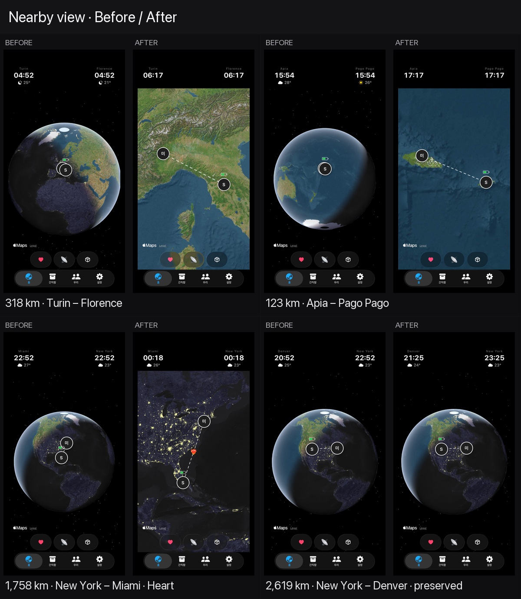

# 근거리 카메라 Before / After

`feature/nearby-view`의 근거리 카메라를 적용하기 전과 후를 같은 iPhone 17 / iOS 26.5 시뮬레이터에서 비교한 기록이다.

## 판정 기준

- 기존 전 지구 카메라와 annotation을 먼저 그대로 커밋한다.
- 두 도시가 모두 카메라 앞면·화면 안에 있고, 아래 둘 중 하나가 충돌할 때만 확대한다.
  - 프로필 중심 간격이 **50pt 미만**: 프로필 사진 지름 46pt + 최소 여백 4pt다.
  - Route 중앙 Heart가 최대 heartbeat 크기(32pt × 1.24)일 때 어느 한 프로필과의 여백이 4pt 미만이다.
- Heart 설정을 나중에 켜도 카메라를 다시 움직이지 않도록 초기 framing에서 Heart 공간을 항상 예약한다.
- 확대 후 프로필 중심 간격은 최소 사용 가능 너비의 65%, 236...248pt를 목표로 한다. 동시에 카메라 거리를 최소 3.35배 가까이 당기고 Route의 구면 중점으로 중심을 옮긴다. 작은 화면·가로 화면에서는 68×92pt 프로필 전체가 남도록 확대 상한을 자동 제한해, 반쯤 잘린 큰 지구나 잘린 끝점 없이 두 사람이 모두 보이는 확실한 지역 뷰까지 들어간다.
- 조건을 통과하지 않으면 카메라를 다시 설정하지 않으므로 기존 지구본을 그대로 유지한다.
- 같은 좌표는 확대해도 분리되지 않으므로 지구본을 유지하고 두 프로필 중심을 68pt 간격으로 나란히 놓는다. 두 annotation의 전체 접근성 영역도 겹치지 않는다.
- Reduce Motion이 켜져 있으면 같은 최종 카메라를 애니메이션 없이 적용한다.
- 확대 대기 중 사용자가 지구를 조작하면 자동 확대를 취소한다.

MapKit 타일과 날씨는 네트워크 데이터이고 시각도 캡처 시각에 따라 달라질 수 있다. 따라서 픽셀 전체가 아니라 지구 카메라, 도시 위치, Route와 프로필 간격을 비교한다.

## 한눈에 보기

- [확대된 18개 조합 전체 시트](png/nearby-framing--zoomed-contact-sheet.png)
- [지구본을 유지한 7개 조합 전체 시트](png/nearby-framing--preserved-contact-sheet.png)
- [Route Heart를 실제로 켠 New York – Miami 최종 화면](png/nearby-framing--new-york-miami-heart-safe.png)

## 거리·투영 조합 25개

| 거리 | 도시 조합 | 결과 | Before | After |
|---:|---|---|---|---|
| 0km | Seoul – Seoul | 지구본 유지, 프로필 한 쌍 분리 | [PNG](png/nearby-before--seoul-seoul.png) | [PNG](png/nearby-after--seoul-seoul.png) |
| 27km | Seoul – Incheon | 근거리 확대 | [PNG](png/nearby-before--seoul-incheon.png) | [PNG](png/nearby-after--seoul-incheon.png) |
| 81km | Florence – Bologna | 근거리 확대 | [PNG](png/nearby-before--florence-bologna.png) | [PNG](png/nearby-after--florence-bologna.png) |
| 123km | Apia – Pago Pago | 근거리 확대, 날짜변경선 인접 | [PNG](png/nearby-before--apia-pago-pago.png) | [PNG](png/nearby-after--apia-pago-pago.png) |
| 124km | Turin – Genoa | 근거리 확대 | [PNG](png/nearby-before--turin-genoa.png) | [PNG](png/nearby-after--turin-genoa.png) |
| 274km | Quito – Guayaquil | 근거리 확대, 적도 인접 | [PNG](png/nearby-before--quito-guayaquil.png) | [PNG](png/nearby-after--quito-guayaquil.png) |
| 281km | Berlin – Prague | 근거리 확대 | [PNG](png/nearby-before--berlin-prague.png) | [PNG](png/nearby-after--berlin-prague.png) |
| 318km | Turin – Florence | 근거리 확대, 요청 사례 | [PNG](png/nearby-before--turin-florence.png) | [PNG](png/nearby-after--turin-florence.png) |
| 325km | Seoul – Busan | 근거리 확대 | [PNG](png/nearby-before--seoul-busan.png) | [PNG](png/nearby-after--seoul-busan.png) |
| 344km | London – Paris | 근거리 확대 | [PNG](png/nearby-before--london-paris.png) | [PNG](png/nearby-after--london-paris.png) |
| 392km | Tokyo – Osaka | 근거리 확대 | [PNG](png/nearby-before--tokyo-osaka.png) | [PNG](png/nearby-after--tokyo-osaka.png) |
| 559km | San Francisco – Los Angeles | 근거리 확대 | [PNG](png/nearby-before--san-francisco-los-angeles.png) | [PNG](png/nearby-after--san-francisco-los-angeles.png) |
| 713km | Sydney – Melbourne | 근거리 확대, 남반구 | [PNG](png/nearby-before--sydney-melbourne.png) | [PNG](png/nearby-after--sydney-melbourne.png) |
| 905km | Singapore – Jakarta | 근거리 확대, 적도 횡단 | [PNG](png/nearby-before--singapore-jakarta.png) | [PNG](png/nearby-after--singapore-jakarta.png) |
| 932km | London – Berlin | 근거리 확대 | [PNG](png/nearby-before--london-berlin.png) | [PNG](png/nearby-after--london-berlin.png) |
| 958km | Tromsø – Longyearbyen | Heart 공간을 확보하는 고위도 지역 확대 | [PNG](png/nearby-before--tromso-longyearbyen.png) | [PNG](png/nearby-after--tromso-longyearbyen.png) |
| 1,149km | Seoul – Tokyo | 근거리 확대 | [PNG](png/nearby-before--seoul-tokyo.png) | [PNG](png/nearby-after--seoul-tokyo.png) |
| 1,434km | London – Rome | Heart 공간을 확보하는 지역 확대 | [PNG](png/nearby-before--london-rome.png) | [PNG](png/nearby-after--london-rome.png) |
| 1,758km | New York – Miami | Heart 공간을 확보하는 지역 확대 | [PNG](png/nearby-before--new-york-miami.png) | [PNG](png/nearby-after--new-york-miami.png) |
| 2,256km | Paris – Istanbul | 기존 지구본 유지 | [PNG](png/nearby-before--paris-istanbul.png) | [PNG](png/nearby-after--paris-istanbul.png) |
| 2,619km | New York – Denver | 기존 지구본 유지 | [PNG](png/nearby-before--new-york-denver.png) | [PNG](png/nearby-after--new-york-denver.png) |
| 3,936km | New York – Los Angeles | 기존 지구본 유지 | [PNG](png/nearby-before--new-york-los-angeles.png) | [PNG](png/nearby-after--new-york-los-angeles.png) |
| 4,672km | Seoul – Singapore | 기존 지구본 유지 | [PNG](png/nearby-before--seoul-singapore.png) | [PNG](png/nearby-after--seoul-singapore.png) |
| 8,898km | Seoul – Florence | 기존 지구본 유지 | [PNG](png/nearby-before--seoul-florence.png) | [PNG](png/nearby-after--seoul-florence.png) |
| 19,614km | Lisbon – Auckland | 기존 준대척 표현 유지 | [PNG](png/nearby-before--lisbon-auckland.png) | [PNG](png/nearby-after--lisbon-auckland.png) |

실제 km가 더 짧거나 길어도 거리 숫자로 자르지 않는다. 기기 크기와 투영 방향을 반영한 프로필·Heart의 실제 화면 간격으로 판단한다. New York – Miami처럼 프로필끼리는 닿지 않아도 중앙 Heart가 들어갈 수 없으면 확대하고, 더 먼 New York – Denver는 두 요소가 모두 안전해 기존 지구본을 유지한다.

## 준대척 회귀

기존 카메라 fallback의 문제 조합 8개와 정상 회귀 조합 5개도 변경 전 commit과 변경 후 코드를 **동일한 ordered JSON**으로 각각 다시 캡처했다. 근거리 카메라는 두 도시가 실제 앞면에 있어야만 동작하므로 이 13개 조합에서는 기존 fallback과 뒷면 표시가 유지된다.

- [동일 입력 준대척 Before / After 시트](png/nearby-framing--antipodal-regression-contact-sheet.png)
- 변경 전 캡처: `png/nearby-regression-before--problem--*.png`, `png/nearby-regression-before--control--*.png`
- 새 문제 조합 캡처: `png/nearby-regression--problem--*.png`
- 새 정상 회귀 캡처: `png/nearby-regression--control--*.png`

화면의 지도 영역을 같은 크기로 축소해 RGB 절대 오차를 계산했을 때 13개 모두 채널 평균 오차가 **0.55...2.72 / 255**였다. 분 단위 시계·날씨·MapKit 타일 로딩 차이를 제외하면 카메라와 Route 표현은 유지됐다.
